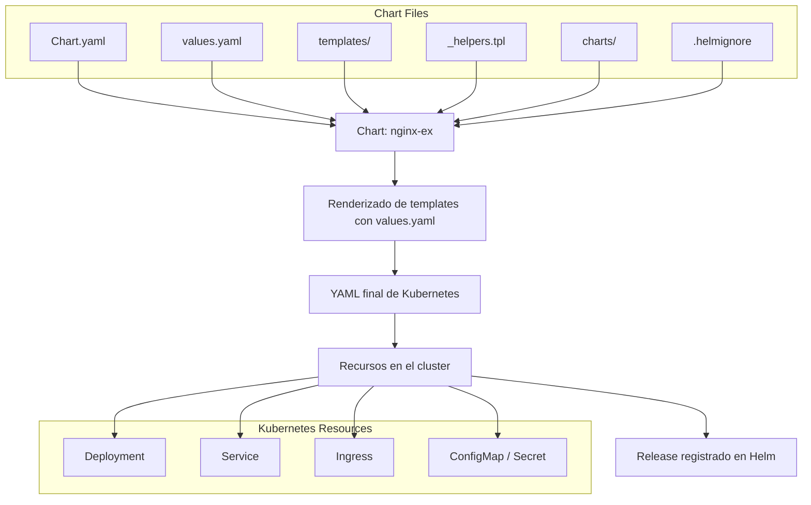

# Create the helmchart
```
helm create webapp1
```


# Follow along with the video
- Create the files per the video, copying and pasting from templates-original
- you can also use the files in the solution folder

# Install the first one
```
helm install mywebapp-release webapp1/ --values webapp1/values.yaml
```

# Upgrade after templating
```
helm upgrade mywebapp-release webapp1/ --values mywebapp/values.yaml
```

# Accessing it
```
minikube tunnel
```

# Create dev/prod
```
k create namespace dev
k create namespace prod
helm install mywebapp-release-dev webapp1/ --values webapp1/values.yaml -f webapp1/values-dev.yaml -n dev
helm install mywebapp-release-prod webapp1/ --values webapp1/values.yaml -f webapp1/values-prod.yaml -n prod
helm ls --all-namespaces
```

Este documento contiene los comandos básicos de Helm para trabajar con charts y releases en Kubernetes.

---

## 1️⃣ Repositorios de Helm

| Comando | Descripción |
|---------|-------------|
| `helm repo add <nombre> <url>` | Agrega un repositorio de charts. Ej: `helm repo add traefik https://helm.traefik.io/traefik` |
| `helm repo update` | Actualiza la información de los charts disponibles. |
| `helm search repo <chart>` | Busca charts en los repositorios agregados. Ej: `helm search repo nginx` |

---

## 2️⃣ Crear un nuevo chart

| Comando | Descripción |
|---------|-------------|
| `helm create <nombre-del-chart>` | Crea la estructura básica de un chart de Helm en un directorio con el nombre indicado. |
| Ejemplo: | `helm create nginx-ex` |

**Archivos generados típicos:**

- `Chart.yaml` → metadata del chart  
- `values.yaml` → valores por defecto  
- `templates/` → templates de Kubernetes  
- `charts/` → subcharts o dependencias  
- `.helmignore` → archivos a ignorar al empaquetar el chart  

---

## 3️⃣ Instalar un chart

| Comando | Descripción |
|---------|-------------|
| `helm install <release-name> <chart> [-n <namespace>] [--values values.yaml]` | Instala un chart con un nombre de release. |
| Ejemplo: | `helm install miweb ./nginx-ex -n default --values values.yaml` |

---

## 4️⃣ Listar releases

| Comando | Descripción |
|---------|-------------|
| `helm list` | Lista los releases en el namespace actual. |
| `helm list -A` | Lista todos los releases en todos los namespaces. |

---

## 5️⃣ Actualizar un release

| Comando | Descripción |
|---------|-------------|
| `helm upgrade <release-name> <chart> [-n <namespace>] [--values values.yaml]` | Actualiza un release existente. |
| Ejemplo: | `helm upgrade miweb ./nginx-ex -n default --values values.yaml` |

---

## 6️⃣ Verificar un release

| Comando | Descripción |
|---------|-------------|
| `helm status <release-name> [-n <namespace>]` | Muestra el estado actual del release. |
| `helm get all <release-name> [-n <namespace>]` | Muestra todos los recursos generados y la configuración completa del release. |
| `helm history <release-name> [-n <namespace>]` | Muestra el historial de actualizaciones del release. |

---

## 7️⃣ Desinstalar un release

| Comando | Descripción |
|---------|-------------|
| `helm uninstall <release-name> [-n <namespace>]` | Elimina un release y todos sus recursos asociados. |
| Ejemplo: | `helm uninstall miweb -n default` |

---

## 8️⃣ Plantillas y depuración

| Comando | Descripción |
|---------|-------------|
| `helm template <chart> [--values values.yaml]` | Renderiza los manifests de Kubernetes **sin instalar** nada. |
| `helm lint <chart>` | Valida que el chart tenga la estructura y sintaxis correcta. |
| `helm rollback <release-name> <revision> [-n <namespace>]` | Revierte un release a una versión anterior. |

---

## 💡 Tips prácticos

- Siempre probar cambios con `helm template` antes de `install` o `upgrade`.  
- Mantener los repos actualizados con `helm repo update`.  
- `helm create` es ideal para iniciar un chart desde cero.  
- NodePorts, hostPorts o MetalLB son útiles para exponer servicios en clusters locales.  

---
# Cómo funciona Helm - Diagrama de flujo

Este diagrama muestra el flujo completo de Helm, desde un chart hasta los recursos aplicados en Kubernetes.

---

## 1️⃣ Flujo general de Helm

```text
+----------------+
|  Chart (nginx) |
|----------------|
| Chart.yaml     |
| values.yaml    |
| templates/     |
| _helpers.tpl   |
+----------------+
        |
        | helm install / upgrade
        v
+-----------------------------+
| Renderizado de templates    |
| con los valores de values.yaml |
+-----------------------------+
        |
        | YAML final de Kubernetes
        v
+-----------------------------+
| Recursos en el cluster       |
| - Deployment                |
| - Service                   |
| - Ingress                   |
| - ConfigMap / Secret        |
+-----------------------------+
        |
        | Helm tracks release
        v
+-----------------------------+
| Release en Helm             |
| - Nombre: miweb            |
| - Namespace: default       |
| - Historia / revisiones    |
+-----------------------------+
```
## 4️⃣ Resumen visual de relaciones
```text
values.yaml ──┐
              │
_templates/ ──>│  Helm renderiza templates con valores
_helpers.tpl ─┘
              │
              v
        YAML final ──> Kubernetes → Deployment, Service, Ingress, etc.
              │
              v
        Helm registra release (miweb)
```
## 5️⃣ Flujo visual de Helm

# Uso de Library Chart con Frontend y Backend
Library Charts en Helm
1️⃣ Qué son

Una Library Chart es un tipo especial de chart en Helm que no se despliega directamente en Kubernetes.

Su propósito es proveer plantillas, funciones y utilidades reutilizables a otros charts.

A diferencia de los charts de aplicación (type: application), no crea recursos por sí mismo como Deployment o Service.

2️⃣ Para qué se usan

Centralizar lógica común: Por ejemplo, generar nombres consistentes, labels, annotations, o snippets de YAML que se repiten en varios charts.

Evitar duplicación: Si tenés varios charts que necesitan los mismos templates, podés ponerlos en una Library Chart y luego incluirla como dependencia.

Facilitar mantenimiento: Si cambias algo en la Library Chart, todos los charts que la usan se benefician

```mermaid
flowchart TD
    subgraph LibraryChart["Library Chart: my-lib"]
        HL[_helpers.tpl]
    end

    subgraph FrontendChart["Chart: frontend (Nginx)"]
        FD_templates[templates/deployment.yaml <br> templates/service.yaml]
        FD_values[values.yaml]
    end

    subgraph BackendChart["Chart: backend (Tomcat)"]
        BD_templates[templates/deployment.yaml <br> templates/service.yaml]
        BD_values[values.yaml]
    end

    subgraph Kubernetes["Cluster Kubernetes"]
        FE_Deployment[Deployment Nginx]
        FE_Service[Service Nginx]
        BE_Deployment[Deployment Tomcat]
        BE_Service[Service Tomcat]
    end

    HL --> FD_templates
    HL --> BD_templates

    FD_templates --> FE_Deployment
    FD_templates --> FE_Service
    BD_templates --> BE_Deployment
    BD_templates --> BE_Service
